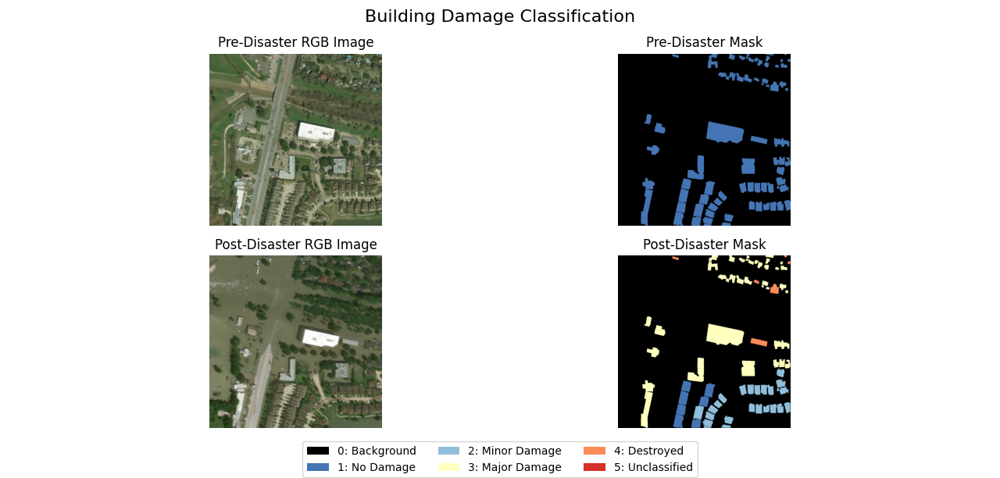

# xView2SiameseUNet


## xView2 Dataset 
The xView2 Dataset contains data from Maxar/Digital Globe. They released those Dataset as part of Challenge in 2019 to develope automized workflows including Deep Learning/Machine Learning for building damage assessment. The main focus lies on the changes between pre and post desaster imagery

The Dataset contains more then 850.000 annotated polygons and damage scores on a building scale. It is divided into 6 different disaster types and covers disasters from around the globe

The datase includes contextual Information as water, fire, smoke or lava. It includes different building types from all around the world as well as negative imagery that do not depict any damage.


xBD: A Dataset for Assessing Building Damage from Satellite Imagery

### Disaster Label:

| Score | Label | Visual Description of the Structure |
| --- | --- | --- |
| 0 | No damage | Undisturbed. No sign of water, structural damage, shingle damage or burn marks |
| 1 | Minor damage | Building partially burnt, water surrounding the structure, volcanic flow nearby, roof elements missing, or visible cracks |
| 2 | Major damage | partial wall or roof collapse, encroaching volcanic flow, or the structure is surrounded by water or mud |
| 3 | Destroyed | Structure is scorched, completely collapsed, partially or completely covred with water or mud, or no longer present. |

### Dataset Split
The following table depicts how the dataset is splitted when downloading it. 
|Split|Images and Masks|
| --- | --- | 
|Tier1|5596|
|Tier3|12738|
|Hold|1866|
|Test|1866|

Above you see the original amount of datasets in each folder:

I created a Train and Validation folder. The Train folder contains all images from Tier1 and 75% of the Images of Tier3, while Validation has all images from the Hold folder as well as 25% of the Tier3 Images.    

So the Trainfolder contains 15148 images and the Validation folder 5052.  

### Example Images



# Structure of the repository and general Information


📁 / (XVIEW2SIAMESEUNET) 
├── 📁 notebooks/   
│ ├── 📁 utils/ 
│ │ ├── 📄 inference.py  
│ │ ├── 📄 metrics.py  
│ │ ├── 📄 training_preparations.py   
│ │ ├── 📄 viz.py  
│ ├── 📄 01_Preprocessing.ipynb  
│ ├── 📄 02_xview2SiameseUNet.ipynb   
├── 📄 pyproject.toml   
├── 📄 README.md  

## Getting Started

To use the code of this repository, clone (or fork) it into the directory you want to work in.

The environment is managed with [`uv`](https://github.com/astral-sh/uv). All required packages are listed in the `pyproject.toml` file.

To set up the environment, simply run:

```bash
module load uv
uv sync
```
### Configuration file:
| Key                               | Description                                                                 |
|----------------------------------|-----------------------------------------------------------------------------|
| `data.user`                      | User Identifier                                    |
| `data.training_name`             | Folder name containing training images and masks                            |
| `data.validation_name`           | Folder name containing validation data                                      |
| `data.test_name`                 | Folder name containing test data                                            |
| `data.use_main_dataset`          | Whether to use the complete xView2 dataset or a smaller subset              |
| `data.experiment_group`          | Label for grouping related experiments (used in logs and outputs)           |
| `data.experiment_id`             | Unique identifier for the current experiment run                            |
| `training.epochs`                | Number of full passes over the training dataset                             |
| `training.batch_size`            | Number of samples per batch                                                 |
| `training.learning_rate`         | Initial learning rate for the optimizer                                     |
| `training.scheduler.T_0`         | Epochs before first scheduler restart                                       |
| `training.scheduler.T_mult`      | Factor by which to increase cycle length after each restart                 |
| `training.scheduler.eta_min`     | Minimum learning rate after cosine annealing restart                        |
| `training.patience`              | Number of epochs with no improvement before early stopping is triggered     |
| `training.delta`                 | Minimum loss improvement to reset early stopping                            |
| `loss_weights.pre`               | Class weights for pre-disaster segmentation (background/building)          |
| `loss_weights.post`              | Class weights for post-disaster segmentation (damage classes)               |
| `dataloader.num_workers_multiplier` | Multiplier for determining DataLoader worker count                        |
| `dataloader.pin_memory`          | Whether to use pinned memory for DataLoader                                 |
| `foldernames.tensorboard_logs`   | Directory where TensorBoard logs are stored                                 |
| `foldernames.checkpoints`        | Directory for saving model checkpoints                                      |
| `foldernames.logfiles`           | Directory for storing training/validation logs                              |
| `foldernames.class_counts_file`  | File path for class frequency stats used in weighting                       |
| `foldernames.sample_weights_file`| File path for sample weights used during training                           |
| `focal_loss.gamma`               | Focal loss parameter to down-weight easy examples                           |


# Informations for developers
## Model Architecture
As a model for building damage assesment a siamese neural network was chosen. It consists of two identical UNets with a ResNET50 encoder.
### Siamese Neural Network
A siamese neural network contains at least two identical sub-networks and is used for tasks where two similar images are given and the aim is to detect similiarities or differences. 
It takes a paired input and gives one output. In this case, for building damage detection the aim was to get a segmentation mask containing the building location and damage grade. 
The siamese structure allwos to detect changes through direct comparison between pre- and post-disaster building states.
**U-Net**
The U-Net architecture has a encoder-decoder structure and skip connections. This helps to preserve spatial information, which are critical for building segmentation and damage patterns.


**ResNet50** 
The ResNet50 was chosen as an encoder. It has a high capability to extract features. A further advantage was the pre-trained backboned. The deep architecture of ResNet50 captures hirachical features that represent different aspect of buildin damage. 

## Dealing with class imbalances
The xView2 dataset has high class imbalances. With more then 90% of all pixels depicting background and not buildings, 
the class imbalances need to be taken into account.
### Focal Loss
https://arxiv.org/pdf/1708.02002
Focal Loss as a Loss Function takes class imbalances into account and downweights the background and therefore focuses on the damage classes.
This was done by weighting each class inversely proportional to its frequency in the dataset, using the alpha parameter to assign higher weights 
to rare classes (buildings and damage categories) and 
lower weights to common classes (background). Additionally, the gamma parameter (set to 2) 
further reduces the contribution of easily classified examples, allowing the model to focus on challenging cases like building boundaries 
and subtle damage patterns.
 
*** Note: Add a histogram of classes ?? ***

## Training
Start the training process by changing the parameters of the configuration file (notebooks/00_config.ymal). Parameters are explained in the configuration file section. 

After this you have two options to run the training: 
02_Training.cmd as a slurm job or the 02_developer_main.py  

All written outputs can be found here: 

├── experiments/
│   └── xView2_all_data/
│       └── 002/
│           ├── tensorboard_logs/
│           ├── checkpoints/
│           ├── logfiles/

The precalculated class counts and weights are stored under:

TODO - Sie werden nicht ins repository gepusht - wo speichern??

├── experiments/  
│   ├── precalculations/  
│   │   ├── class_counts.json  
│   │   └── sample_weights.pth

The model is stored within the checkpoints directory under the filename: 002_best_siamese_unet_state.pth

To run inference for this model use the file 03_user_main.ipynb. More information about this file can be found in the following section Informations for users.

# Informations for users

If you want to assess building damage run the jupyter notebook 03_user_main.ipynb.

Please note that so far this script is not working with the 