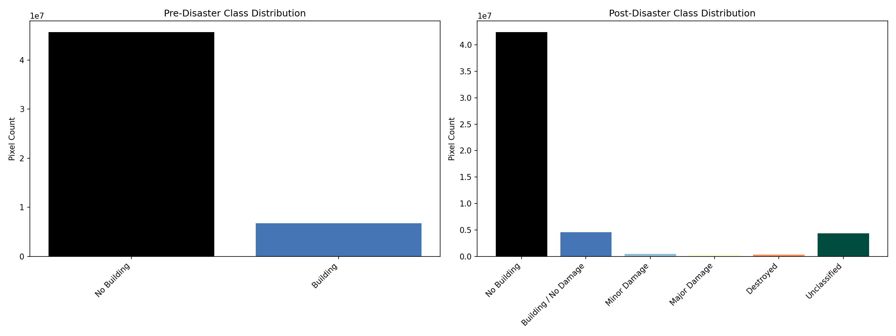
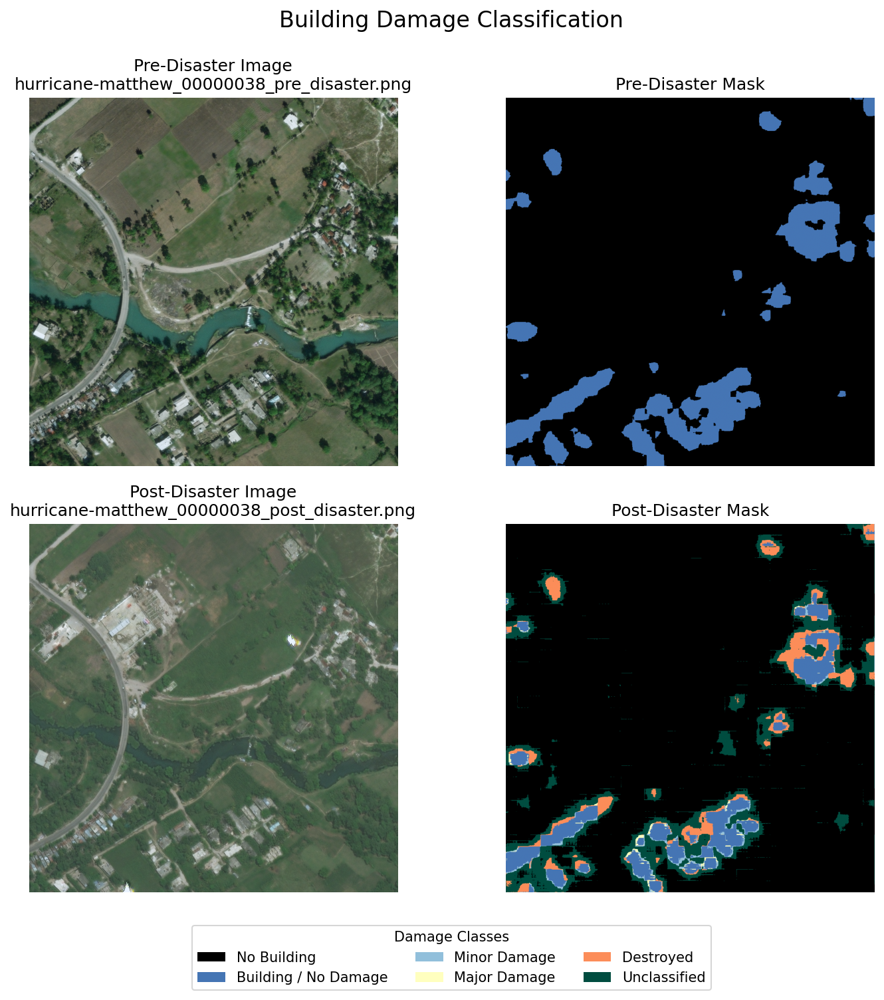
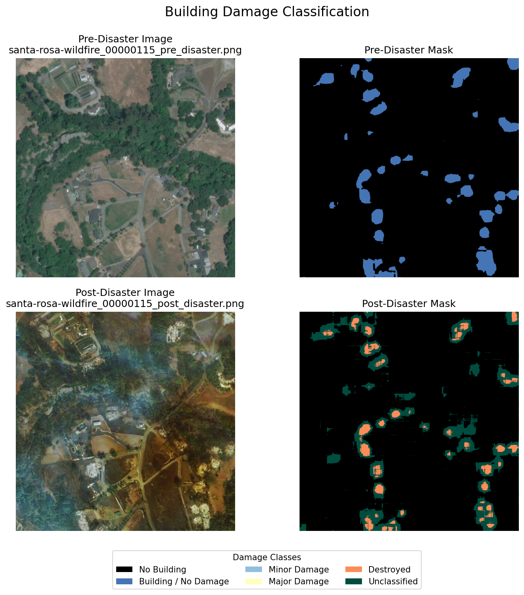
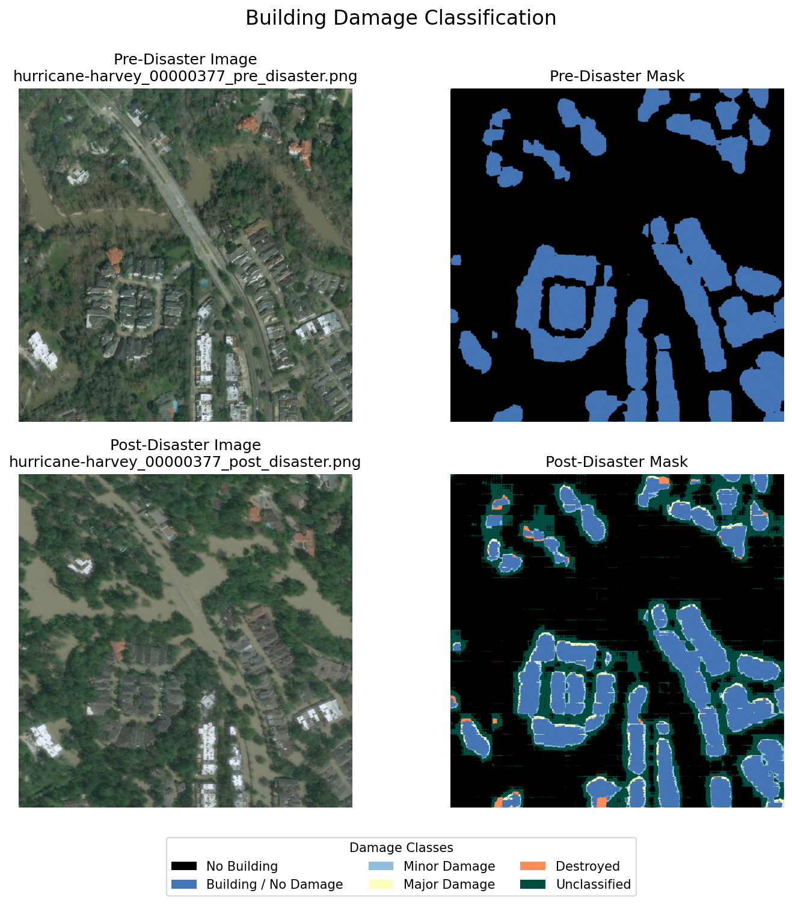
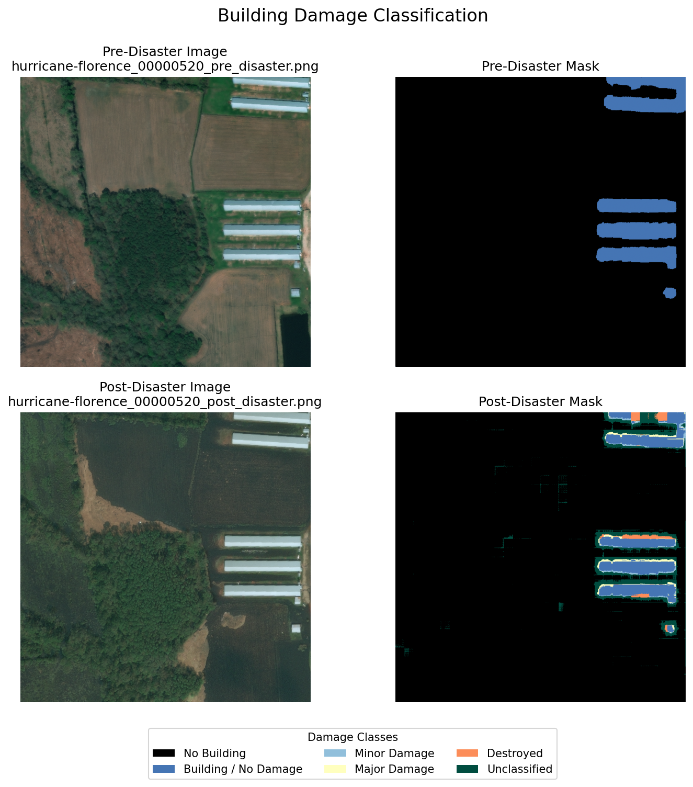
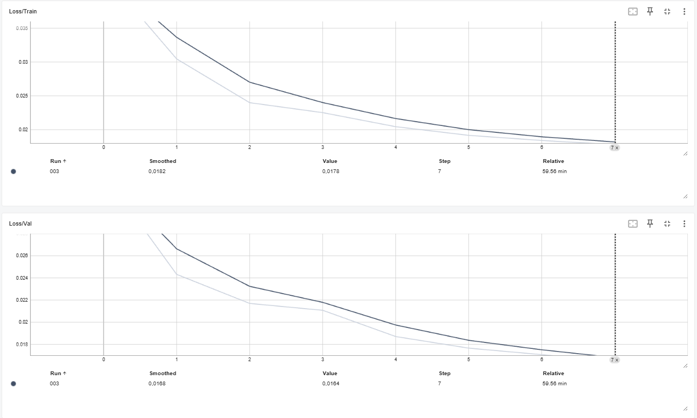
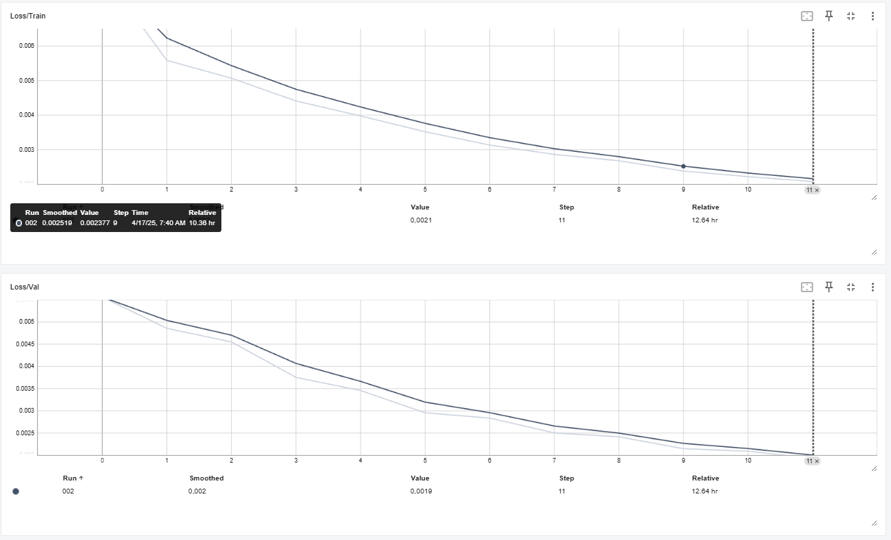

# xView2SiameseUNet


## xView2 Dataset 
The xView2 Dataset contains data from Maxar/Digital Globe. They released those Dataset as part of Challenge in 2019 to develope automized workflows including Deep Learning/Machine Learning for building damage assessment. The main focus lies on the changes between pre and post desaster imagery

The Dataset contains more then 850.000 annotated polygons and damage scores on a building scale. It is divided into 6 different disaster types and covers disasters from around the globe

The datase includes contextual Information as water, fire, smoke or lava. It includes different building types from all around the world as well as negative imagery that do not depict any damage.

For more information see the paper: 
xBD: A Dataset for Assessing Building Damage from Satellite Imagery

### Disaster Label:

| Score | Label | Visual Description of the Structure |
| --- | --- | --- |
| 0 | No damage | Undisturbed. No sign of water, structural damage, shingle damage or burn marks |
| 1 | Minor damage | Building partially burnt, water surrounding the structure, volcanic flow nearby, roof elements missing, or visible cracks |
| 2 | Major damage | partial wall or roof collapse, encroaching volcanic flow, or the structure is surrounded by water or mud |
| 3 | Destroyed | Structure is scorched, completely collapsed, partially or completely covred with water or mud, or no longer present. |

### Dataset Split
The following table depicts how the dataset is splitted when downloading it. 
|Split|Images and Masks|
| --- | --- | 
|Tier1|5596|
|Tier3|12738|
|Hold|1866|
|Test|1866|

Above you see the original amount of datasets in each folder:

I created a Train and Validation folder. The Train folder contains all images from Tier1 and 75% of the Images of Tier3, while Validation has all images from the Hold folder as well as 25% of the Tier3 Images.    

So the Trainfolder contains 15148 images and the Validation folder 5052.  

### Example Images


# Structure of the repository and general Information


📁 / (XVIEW2SIAMESEUNET)  
├── 📁 notebooks/      
│ ├── 📁 utils/  
│ │ ├── 📄 dataset.py  
│ │ ├── 📄 earlyStopping.py  
│ │ ├── 📄 helperfunctions.py  
│ │ ├── 📄 inference_step.py  
│ │ ├── 📄 metrics.py  
│ │ ├── 📄 preprocessing.py  
│ │ ├── 📄 train_step.py  
│ │ ├── 📄 val_step.py  
│ │ ├── 📄 training_preparations.py   
│ │ ├── 📄 viz.py  
│ ├── 📁 model/   
│ │ ├── 📄 loss.py    
│ │ ├── 📄 siameseNetwork.py     
│ │ ├── 📄 uNet.py    
│ ├── 📁 predictions_visualization/   
│ ├── 📄 00_config.yaml    
│ ├── 📄 01_data_processing.py    
│ ├── 📄 02_Training.cmd  
│ ├── 📄 02_developer_main.py  
│ ├── 📄 03_inference.ipynb     
├── 📄 pyproject.toml   
├── 📄 README.md  

## Getting Started

To use the code of this repository, clone (or fork) it into the directory you want to work in.

The environment is managed with [`uv`](https://github.com/astral-sh/uv). All required packages are listed in the `pyproject.toml` file.

To set up the environment, simply run:

```bash
module load uv
uv sync
```
### Configuration file:
| Key                               | Description                                                                 |
|----------------------------------|-----------------------------------------------------------------------------|
| `data.user`                      | User Identifier                                    |
| `data.training_name`             | Folder name containing training images and masks                            |
| `data.validation_name`           | Folder name containing validation data                                      |
| `data.test_name`                 | Folder name containing test data                                            |
| `data.use_main_dataset`          | Whether to use the complete xView2 dataset or a smaller subset              |
| `data.experiment_group`          | Label for grouping related experiments (used in logs and outputs)           |
| `data.experiment_id`             | Unique identifier for the current experiment run                            |
| `training.epochs`                | Number of full passes over the training dataset                             |
| `training.batch_size`            | Number of samples per batch                                                 |
| `training.learning_rate`         | Initial learning rate for the optimizer                                     |
| `training.scheduler.T_0`         | Epochs before first scheduler restart                                       |
| `training.scheduler.T_mult`      | Factor by which to increase cycle length after each restart                 |
| `training.scheduler.eta_min`     | Minimum learning rate after cosine annealing restart                        |
| `training.patience`              | Number of epochs with no improvement before early stopping is triggered     |
| `training.delta`                 | Minimum loss improvement to reset early stopping                            |
| `loss_weights.pre`               | Class weights for pre-disaster segmentation (background/building)          |
| `loss_weights.post`              | Class weights for post-disaster segmentation (damage classes)               |
| `dataloader.num_workers_multiplier` | Multiplier for determining DataLoader worker count                        |
| `dataloader.pin_memory`          | Whether to use pinned memory for DataLoader                                 |
| `foldernames.tensorboard_logs`   | Directory where TensorBoard logs are stored                                 |
| `foldernames.checkpoints`        | Directory for saving model checkpoints                                      |
| `foldernames.logfiles`           | Directory for storing training/validation logs                              |
| `foldernames.class_counts_file`  | File path for class frequency stats used in weighting                       |
| `foldernames.sample_weights_file`| File path for sample weights used during training                           |
| `focal_loss.gamma`               | Focal loss parameter to down-weight easy examples                           |


# Informations for developers
## Model Architecture
As a model for building damage assesment a siamese neural network was chosen. It consists of two identical UNets with a ResNET50 encoder.
### Siamese Neural Network
A siamese neural network contains at least two identical sub-networks and is used for tasks where two similar images are given and the aim is to detect similiarities or differences. 
It takes a paired input and gives one output. In this case, for building damage detection the aim was to get a segmentation mask containing the building location and damage grade. 
The siamese structure allwos to detect changes through direct comparison between pre- and post-disaster building states.  
**U-Net**  
The U-Net architecture has a encoder-decoder structure and skip connections. This helps to preserve spatial information, which are critical for building segmentation and damage patterns.


**ResNet50** 
The ResNet50 was chosen as an encoder. It has a high capability to extract features. A further advantage was the pre-trained backboned. The deep architecture of ResNet50 captures hirachical features that represent different aspect of buildin damage. 

## Dealing with class imbalances
The xView2 dataset has high class imbalances. With more then 90% of all pixels depicting background and not buildings, 
the class imbalances need to be taken into account.
### Focal Loss

https://arxiv.org/pdf/1708.02002  

Focal Loss as a Loss Function takes class imbalances into account and downweights the background and therefore focuses on the damage classes.
This was done by weighting each class inversely proportional to its frequency in the dataset, using the alpha parameter to assign higher weights 
to rare classes (buildings and damage categories) and 
lower weights to common classes (background). Additionally, the gamma parameter (set to 2) 
further reduces the contribution of easily classified examples, allowing the model to focus on challenging cases like building boundaries 
and subtle damage patterns.
 
## Training
Start the training process by changing the parameters of the configuration file (notebooks/00_config.ymal). Parameters are explained in the configuration file section. 

After this you have two options to run the training: 
02_Training.cmd as a slurm job or the 02_developer_main.py  

All written outputs can be found here: 

├── experiments/  
│   └── xView2_all_data/  
│       └── 002/  
│           ├── tensorboard_logs/  
│           ├── checkpoints/  
│           ├── logfiles/  

The precalculated class counts and weights are stored under  

├── experiments/  
│   ├── precalculations/  
│   │   ├── class_counts.json  
│   │   └── sample_weights.pt  


The model is stored within the checkpoints directory under the filename: 002_best_siamese_unet_state.pth  

To run inference for this model use the file 03_inference.ipynb. More information about this file can be found in the following section Informations for users.  

# Informations for users

If you want to assess building damage run the jupyter notebook 03_inference.ipynb.

Please note that the Script is only tested with a subset of the xView2 Dataset and previously crashed with the complete dataset.

## Prediction
Below you can find the distribution of pixels for the inference and a few sample plots. 

Note, that the images are still transformed. 







# Model Performance
The Model performance was tested with a subset of 200 Images (100 Images pairs) and 100 Images for Validation and Inference. 
The tensorboard_logs, checkpoints and logfiles are saved in the Homedirectory. 

Under checkpoints the best model is saved as well and can be loaded for training (003_best_siamese_unet_state.pth). 

## === Training Parameters ===  
training:  
  *Number of training epochs*  
  epochs: 80  
  Batch size for training and validation   
  batch_size: 8  
  Learning rate for the optimizer  
  learning_rate: 0.0001  
  *CosineAnnealingWarmRestarts scheduler settings*   
  scheduler:  
    T_0: 10            *Number of epochs before the first restart*  
    T_mult: 2          *Multiplier for increasing the restart period*  
    eta_min: 0.000001  *Minimum learning rate after a restart*  
  *Early stopping: how many epochs to wait without improvement*  
  patience: 5  
  *Minimum improvement in validation loss to reset early stopping*  
  delta: 0.01  

## === Loss Class Weights ===   
loss_weights:  
  pre:  
    *Class weights for the pre-disaster segmentation  
    0 = background, 1 = building*  
    0: 1.0  
    1: 10.0  
  post:  
    *Class weights for post-disaster damage segmentation  
    0 = background, 1–4 = various damage levels, 5 = destroyed*  
    0: 1.0  
    1: 10.0  
    2: 30.0  
    3: 20.0  
    4: 50.0  
    5: 100.0  

## === Dataloader Settings ===  
dataloader:  
  *Multiplier for determining number of data loading workers (based on CPU cores)*  
  num_workers_multiplier: 4  
  *Whether to use pinned memory for faster GPU transfers*  
  pin_memory: true  

## Results:  
Model training ended after 7 Epochs:  

|Parameter|Pre-Disaster|Post-Disaster|  
|---------|------------|-------------|
|F1-Score Training|0.8184| 0.2957
|F1-Score Validation |0.8184|0.3205|
|Precision Training|0.7402|0.2822|
|Precision Validation|0.7526|0.2959|
|Recall Training|0.9537|0.4447|
|Recall Validation|0.9583|0.4769|

Loss during Training was 0.0178 and during Validation 0.0164. See Image below




## Discussion
### Results
- **Early Training Termination**: The Training Ended after only 7 of 80 planned Epochs. Possible reasons are the very strickt Early Stopping after only 5 Epochs when the validation loss lacks to improve.    
- The results show a **divergence between Pre- and Post-disaster** Results. While Pre-disaster detection shows a solid performance, Post-disaster Detection is significantly weaker  
- In Pre- and Post Desaster Classification **recall is higher then precision** which suggests a tendency towards over-classification  
- **Validation trend is positive** and slightly better then Training therefore no overfitting is occuring  

### Possible causes for Weak Post disaster Performance

- **Class Complexity:** Post-disaster classification includes 6 classes (background + 5 damage classes) compared to only 2 classes (background + building) in pre-disaster detection.   
- **Class Imbalance:** The high weightings for post-disaster classes (up to 100 for destroyed buildings) indicate severely imbalanced classes.  
- **Data Scarcity:** Using a small subset (100 image pairs) may be insufficient, especially for detecting rarer damage classes.  


## Improving the training process  
To improve the performance the training should be run with the whole dataset.


To the point of submission training is still running and in Step 11:



|Parameter|Pre-Disaster|Post-Disaster|  
|---------|------------|-------------|
|F1-Score Training|0.8277| 0.4608|
|F1-Score Validation |0.8384|0.4777|
|Precision Training|0.7577|0.3869|
|Precision Validation|0.7645|0.4036|
|Recall Training|0.9793|0.8413|
|Recall Validation|0.9805|0.8294|

These preliminary results indicate a significant improvement within the post disaster Performance of the model. 

The updated parameters can be found below:  


### === Training Parameters ===  
training:  
  *Number of training epochs*  
  epochs: 100  
  *Batch size for training and validation*  
  batch_size: 8  
  *Learning rate for the optimizer*   
  learning_rate: 0.00003   
  *CosineAnnealingWarmRestarts scheduler settings*  
  scheduler:  
    T_0: 20            *Number of epochs before the first restart*  
    T_mult: 1         *Multiplier for increasing the restart period*  
    eta_min: 0.0000001   *Minimum learning rate after a restart*  
  *Early stopping: how many epochs to wait without improvement*  
  patience: 20  
  *Minimum improvement in validation loss to reset early stopping*  
  delta: 0.001  

### === Loss Class Weights ===  
loss_weights:  
  pre:  
    *Class weights for the pre-disaster segmentation  
    0 = background, 1 = building*  
    0: 1.0  
    1: 5.0  
  post:  
    *Class weights for post-disaster damage segmentation  
    0 = background, 1–4 = various damage levels, 5 = destroyed*  
    0: 1.0   
    1: 5.0 # reduced form 10  
    2: 15.0 # reduced from 30  
    3: 10.0 # reduced from 20  
    4: 20.0 # reduced from 50  
    5: 30.0 # reduced from 100  
