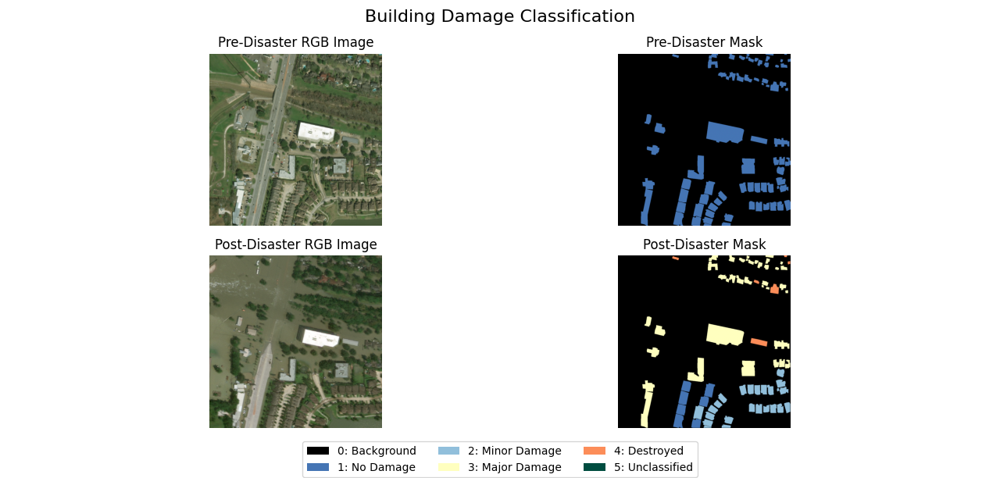

# xView2SiameseUNet


## xView2 Dataset 
The xView2 Dataset contains data from Maxar/Digital Globe. They released those Dataset as part of Challenge in 2019 to develope automized workflows including Deep Learning/Machine Learning for building damage assessment. The main focus lies on the changes between pre and post desaster imagery

The Dataset contains more then 850.000 annotated polygons and damage scores on a building scale. It is divided into 6 different disaster types and covers disasters from around the globe

The datase includes contextual Information as water, fire, smoke or lava. It includes different building types from all around the world as well as negative imagery that do not depict any damage.


xBD: A Dataset for Assessing Building Damage from Satellite Imagery

### Disaster Label:

| Score | Label | Visual Description of the Structure |
| --- | --- | --- |
| 0 | No damage | Undisturbed. No sign of water, structural damage, shingle damage or burn marks |
| 1 | Minor damage | Building partially burnt, water surrounding the structure, volcanic flow nearby, roof elements missing, or visible cracks |
| 2 | Major damage | partial wall or roof collapse, encroaching volcanic flow, or the structure is surrounded by water or mud |
| 3 | Destroyed | Structure is scorched, completely collapsed, partially or completely covred with water or mud, or no longer present. |

### Dataset Split

|Split|Images and Masks|
| --- | --- | 
|Tier1|5596|
|Tier3|12738|
|Hold|1866|
|Test|1866|

### Example Images



# Structure of the repository and general Information
📁 / (XVIEW2SIAMESEUNET) 
├── 📁 notebooks/ │ 
├── 📁 utils/ │
│ ├── 📄 inference.py │
│ ├── 📄 metrics.py │ │
├── 📄 training_preparations.py │
│ ├── 📄 viz.py │
├── 📄 01_Preprocessing.ipynb │
├── 📄 02_xview2SiameseUNet.ipynb 
├── 📄 pyproject.toml 
├── 📄 README.md

## Getting Started

To use the code of this repository, clone (or fork) it into the directory you want to work in.

The environment is managed with [`uv`](https://github.com/astral-sh/uv). All required packages are listed in the `pyproject.toml` file.

To set up the environment, simply run:

```bash
module load uv
uv sync
```

# Informations for developers
## Model Architecture
As a model for building damage assesment a siamese neural network was chosen. It consists of two identical UNets with a ResNET50 encoder.
### Siamese Neural Network
A siamese neural network contains at least two identical sub-networks and is used for tasks where two similar images are given and the aim is to detect similiarities or differences. 
It takes a paired input and gives one output. In this case, for building damage detection the aim was to get a segmentation mask containing the building location and damage grade. 
The siamese structure allwos to detect changes through direct comparison between pre- and post-disaster building states.
** U-Net **
The U-Net architecture has a encoder-decoder structure and skip connections. This helps to preserve spatial information, which are critical for building segmentation and damage patterns.


** ResNet 50 ** 
The ResNet50 was chosen as an encoder. It has a high capability to extract features. A further advantage was the pre-trained backboned. The deep architecture of ResNet50 captures hirachical features that represent different aspect of buildin damage. 

## Dealing with class imbalances
The xView2 dataset has high class imbalances. With more then 90% of all pixels depicting background and not buildings, 
the class imbalances need to be taken into account.
### Focal Loss
https://arxiv.org/pdf/1708.02002
Focal Loss as a Loss Function takes class imbalances into account and downweights the background and therefore focuses on the damage classes.
This was done by weighting each class inversely proportional to its frequency in the dataset, using the alpha parameter to assign higher weights 
to rare classes (buildings and damage categories) and 
lower weights to common classes (background). Additionally, the gamma parameter (set to 2) 
further reduces the contribution of easily classified examples, allowing the model to focus on challenging cases like building boundaries 
and subtle damage patterns.
 
*** Note: Add a histogram of classes ?? ***

## 
